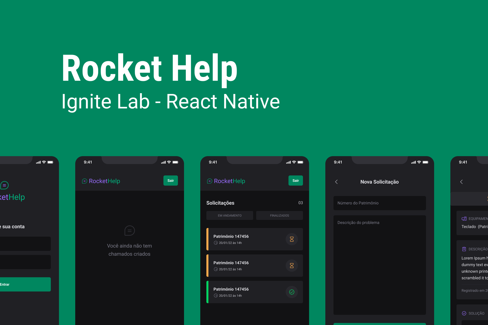

## 👨🏽‍💻 Stack
-  [ ] React Native
-  [ ] Typescript
-  [ ] Expo
-  [ ] Native Base
-  [ ] Firebase

## 🔖 Layout

Você pode visualizar o layout deste projeto através [desse link](https://www.figma.com/community/file/1130846653327904117).
Lembrando que é necessário ter uma conta no [Figma](http://figma.com/) para poder acessar.

## Executando o projeto
 Faça o clone deste projeto em seu computador e depois execute com o Expo: 
 
 ```bash
  git clone branch_url
  cd expensesapp
  npm install
  expo start
```
